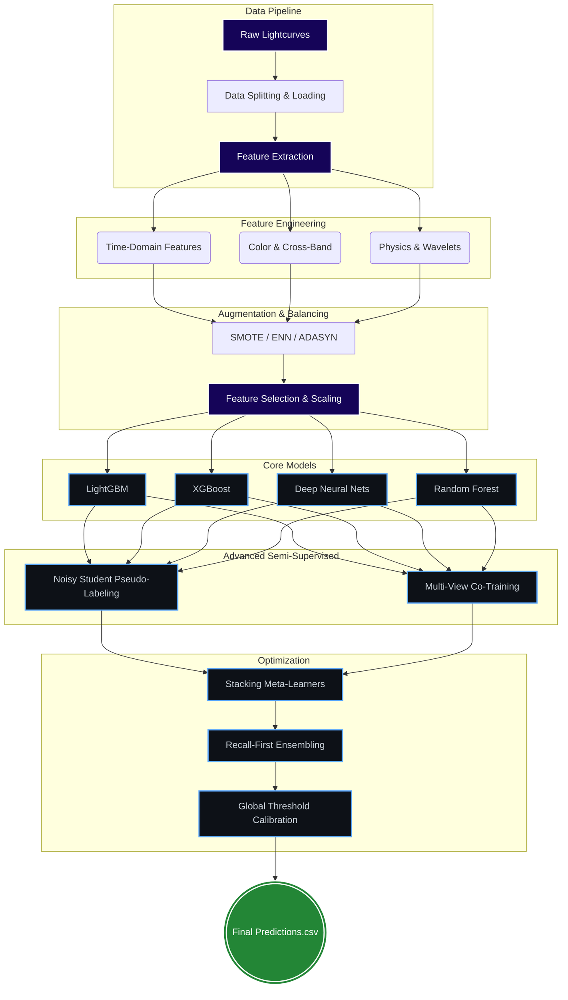

# 🌌 MALLORN
> **M**any **A**rtificial **L**SST **L**ightcurves based on **O**bservations of **R**eal **N**uclear transients


MALLORN is a specialized astronomical classification pipeline engineered to detect **Tidal Disruption Events (TDEs)**—rare instances where a star is torn apart by a supermassive black hole—from photometric light curves. Built for upcoming synoptic surveys like the **Vera C. Rubin Observatory (LSST)**, it physically models extreme transient phenomena and separates them from vast backgrounds of supernovae and variable stars.

---

## 🏗️ System Architecture

Our pipeline is heavily modularized for professional execution, scaling, and research iterations. 



## 🚀 Key Features

- **Extensive Feature Extraction**: Automatically calculates Physics-based features (Bazin functions, power-law fitting), Time-domain signals (FFT, wavelets, Gaussian Processes), and multi-band Color interactions.
- **Advanced Class Balancing**: Integrates SMOTE, SVMSmote, ADASYN, and Tomek Links to seamlessly handle severe target imbalances (e.g., 150:1 ratios).
- **Semi-Supervised Learning**: Implements **Noisy Student Pseudo-Labeling** and **Multi-View Co-Training** to harness unlabeled data iteratively and significantly boost F1 margins.
- **Robust Ensembling**: Features stacked meta-learners with isotonic probability calibration, Rank-based ensembling, and a specialized **Recall-First Gating** mechanism to prioritize rare events.
- **Deep Learning Support**: Ships with robust architectures built in PyTorch (ResBlocks, SEBlocks, Focal Loss) and hooks for Vision Transformer interfaces (`SwinV2`).

## 📁 Directory Structure

The repository is logically modularized into discrete, independent domains:

```text
MALLORN/
├── mallorn/
│   ├── config.py           # Single source of truth for global configuration & hyperparameters
│   ├── utils.py            # Diagnostic tools, math utilities, and I/O formatters
│   ├── data/               # Augmentation (SMOTE), PyTorch datasets, and advanced pseudo-labeling
│   ├── features/           # Lightcurve feature extraction, physical models, aggressive dimensionality reduction
│   ├── models/             # PyTorch Neural Networks, Tree hyperparams, calibration routines
│   └── training/           # Iterative Stratified CV loops, model ensembling, F1 threshold optimization
├── run_pipeline.py         # ⚡ The main execution script connecting all modules seamlessly
└── requirements.txt        # Comprehensive Python dependencies
```

## 🛠️ How to Run

1. **Install Dependencies**
   Ensure you have Python 3.8+ installed, then install the required packages:
   ```bash
   pip install -r requirements.txt
   ```

2. **Prepare Data**
   The raw astronomical lightcurves and metadata used for this pipeline are hosted externally due to size constraints. Download the dataset directly from Kaggle:
   - [MALLORN Astronomical Classification Challenge](https://www.kaggle.com/competitions/mallorn-astronomical-classification-challenge/data)
   
   Extract the downloaded archive directly into the root repository folder. Your structure should look like this (or you can manually redirect `BASE_DIR` inside `mallorn/config.py`):
   - `train_log.csv`
   - `test_log.csv`
   - `split_01/`, `split_02/`, `split_03/`, etc.

3. **Execute the Pipeline**
   Trigger the fully orchestrated training, ensembling, and inference orchestrator:
   ```bash
   python run_pipeline.py
   ```

## ⚙️ Configuration Tuning
Everything is customizable inside `mallorn/config.py`. Key pipeline parameters include:

- **Model Selection:** `USE_LGBM`, `USE_XGB`, `USE_NN`, `USE_RF`
- **Imbalance Strategies:** Enable via `USE_SMOTE_ENN`, `USE_ADASYN`, `USE_BORDERLINE_SMOTE`
- **Semi-Supervised Flow:** Scale capabilities via `USE_ADVANCED_PSEUDO_LABELS`, `USE_MULTI_VIEW_COTRAINING`
- **Losses:** Optimize precision/recall balance universally mapped via `FOCAL_LOSS_GAMMA` and `FOCAL_LOSS_ALPHA`.

## 📈 Output & Deliverables
Upon completion, the pipeline outputs:
- **`predictions.csv`**: The fully optimized list of target inferences for your test dataset.
- **Telemetry & Diagnostics**: Detailed Out-of-Fold (OOF) cross-validation metrics inside your console (F1, Precision, Recall, and P-R Gaps).
- **Thresholds**: Formally evaluated median thresholds calculated across repeated stratified folds ensuring real-world deployment readiness.
